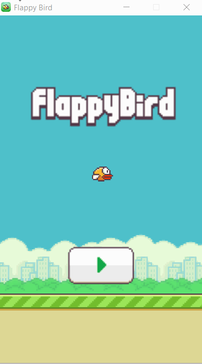
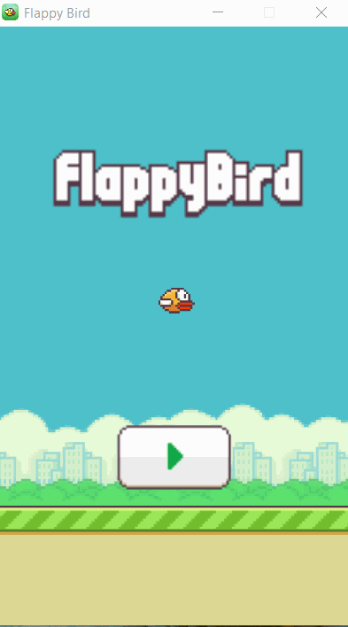
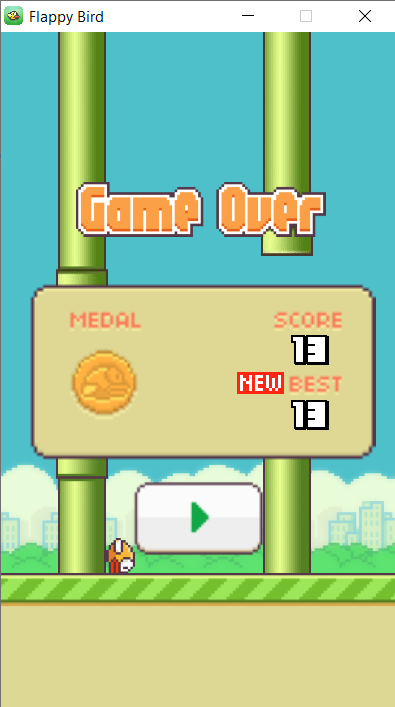
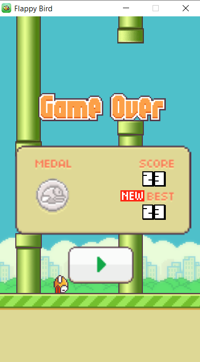
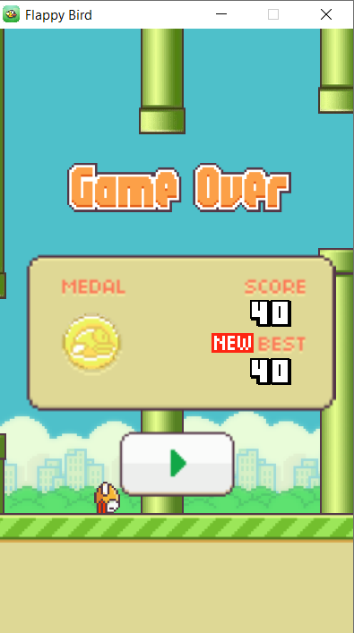
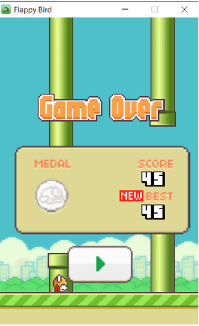

# Flappy Bird Clone

## Author  
### Huan Le

## Date Created  
### 7/22/2020
---
Description of The Game
---
* The clone **Flappy Bird** is written in Java as a dedication to the game itself.
 
* To those who have not known this game, **Flappy Bird** is a mobile game created by a Vietnamese video game artist and programmer **Nguyen Ha Dong**. The game was published in *May 2013* and was removed from appstore in *Feb 2014* due to the stress that the creator had had to endure.

* The game is quite simple. You can simply use the mouse to click or press the spacebar to play. There will be pipes that will appear when you start the game. You will have to dodge it by pressing the spacebar or clicking the screen with your mouse. Simple as that

* I have tried to make it as close to the original one as possible. The game also has sound included.

Demo of The Game
---
* The beginning  

* Gameplay  
  

### The game also displays different medals when you die
* Bronze  
  
* Silver  
  
* Gold  
  
* Diamond  
  

---
How To Play
---
* Clone this repository and open the `flappy-bird.exe` file to play the game
# Hope you would enjoy this Flappy Bird Clone!!!
